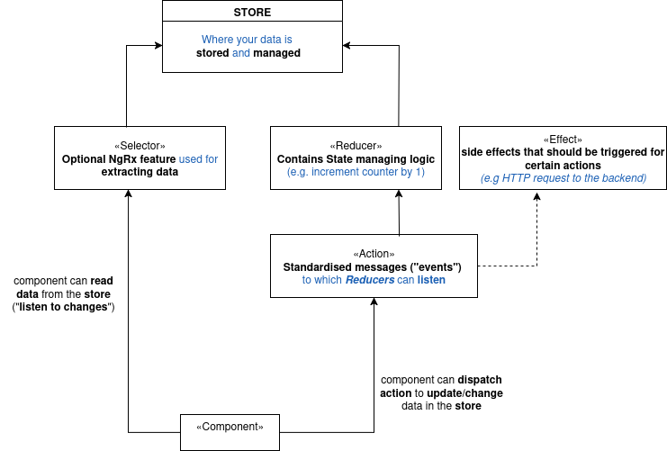

# Angular state management using NgRx

## Introduction

_NgRx_ is _state management solution_ used for complex application-wide system. 
It may be used insteadd of managing complex state in components or services

It works around four main concepts:

1. State
2. Reducers
3. Selectors
4. Effects

## Uderstanding NgRx and its building blocks

Once you have NgRx installed in your project you can and you _should_ create a _store_


### Store

A store is a _Data/State_ store which is where your data will be _stored_ and _managed_ by NgRx


Your components can:
1. reach out to the store to _read_ the state data
2. listen to data _changes_ so that the component can update the UI as data changes in the store

### Extracting Data from the store: Selectors

A _Selector_ is an NgRx feature used for _reading_ and _extracting_ data from the Store. 
That is, using _Selectors_ your component can _read/extract_ the data in the _store_

### Changing/Updating Data in the Store: Actions and Reducers

#### Action

To update data in the Store, your component needs to _dispatch actions_ which describe the changes to be performed and
add any extra data that might be needed for those changes

#### Reducers

Those _dispatched actions_ are picked up by the so-called _reducers_ which you define as part of setting up the state management system.
A _reducer_ contains the _actual logic for updating/changing the store data

#### Effects

Effects are simply _side effects_ that should be triggered for certain actions. For exemple, an HTTP request to the backend that should also be triggered when certain actions are dispatched.

#### The big picture

```
An Action is a Standardized message ("events") to which reducers listen

A Reducer contains State changing logic (e.g. increment a counter by 1)

An effect is a secondary/side effect triggered for certain actions like sending an HTTP request
```



## Installing NgRx

In the system terminal use the command:

```
  ng add @ngrx/store
```

This will install NgRx in the projecct and update your src/main.ts by adding in the providers array
_provideStore()_ where _StoreModule is imported from _@ngrx/store_

```
import { bootstrapApplication } from '@angular/platform-browser';

import { AppComponent } from './app/app.component';
import { provideStore } from '@ngrx/store';

bootstrapApplication(AppComponent, {
    providers: [provideStore()]
});
```

### Note

_provideStore()_ is the line of code that's responsible for setting up a _store_ in the application.


## Adding a first reducer and store setup

#### Introduction

To get data into the store we need a reducer because _reducers_ are the things that change data in the store

```
A reducer is used to set up initial data in the store and potentially change it over time
```

#### Adding a directory store to the application

We create the _app/store_ direcctory where we'll keep NgRx specific files 

#### Create a first reducer _app/store/counter.reducer.ts_

```
import { createReducer } from "@ngrx/store";

/* 
* The initial state can be a boolean, a number, an object etc...
* For our counter our initial state is the number 0
*/
const initialState = 0;

/*
* A reducer is created with at least one parameter: the initial state
* Here we create a simple reducer for our counter.
* It's not too useful yet because it does not contain the logic to modify
* our state (i.e. the logic to increment our counter)
*/
export const counterReducer = createReducer(
  initialState
);
```

#### Connect the reducer to our store

We connect the reducer to our store by modifying the store setup (i.e. the line _provideStore()_) in our main.ts

The _provideStore()_ takes in as first parameter an _object_ that associates a _key_ of your choice to the corresponding _reducer_


```
import { bootstrapApplication } from '@angular/platform-browser';

import { AppComponent } from './app/app.component';
import { provideStore } from '@ngrx/store';
import { counterReducer } from './app/store/counter.reducer';

bootstrapApplication(AppComponent, {
    providers: [provideStore({
      counter: counterReducer
    })]
});

```

If we had another reducer, say _authReducer_ we'd connect it to the store using a key like _auth_:

```
import { bootstrapApplication } from '@angular/platform-browser';

import { AppComponent } from './app/app.component';
import { provideStore } from '@ngrx/store';
import { counterReducer } from './app/store/counter.reducer';
import { authReducer } from './app/store/auth.reducer';

bootstrapApplication(AppComponent, {
    providers: [provideStore({
      counter: counterReducer,
      auth: authReducer
    })]
});
```


## An alternative way of creating a reducer

As we saw, creating a reducer is quite simple. You just have to execute the _createReducer()_ function which is provided by NgRx store:

```
import { createReducer } from "@ngrx/store";

/*
* The initial state can be a boolean, a number, an object etc...
* For our counter our initial state is the number 0
*/
const initialState = 0;

/*
* A reducer is created with at least one parameter: the initial state
* Here we create a simple reducer for our counter.
* It's not too useful yet because it does not contain the logic to modify
* our state (i.e. the logic to increment our counter)
*/
export const counterReducer = createReducer(
  initialState
);
```

Now it can be interesting to take a look under the hood of what _createReducer()_ to see what's really happening and how we can create a reducer in _older version of NgRx where createReducer() is not provided_.

In this alternative approach you create your reducer manually by defining a function that takes in a first parameter the _current state_ and returns the _updated state_

```
import { createReducer } from "@ngrx/store";

/*
* The initial state can be a boolean, a number, an object etc...
* For our counter our initial state is the number 0
*/
const initialState = 0;

/*
*
* Here we create a simple reducer for our counter.
* It's not too useful yet because it does not contain the logic to modify
* our state (i.e. the logic to increment our counter)
*
* counterReducer and counterReducerV2 are identical and for now look quite similar
* but we'll see some difference later when we'll start adding some logic to the
* reducer
*/

/*
* A reducer is created with at least one parameter: the initial state
*/
export const counterReducer = createReducer(
  initialState
);


/*
* The alternative approach to create a reducer is to define a function
* which takes as first parameter the current state and returns the updated state
* 1. This approach works in all versions of NgRx
* 2. we set the default value of the state to be the initial state as the first
*    time this function is called there is no state. As a result, the first time
*    this function is called it returns the initial state
*/
export function counterReducerV2(state = initialState) {
  return state;
}
```

## Reading data from the store

We've added to our store a _counter_ key which is associated with the _counterReducerV2_. 

Our current _main.ts_ looks like:

```
import { bootstrapApplication } from '@angular/platform-browser';

import { AppComponent } from './app/app.component';
import { provideStore } from '@ngrx/store';
import { counterReducerV2 } from './app/store/counter.reducer';

bootstrapApplication(AppComponent, {
    providers: [provideStore({
      counter: counterReducerV2
    })]
});
```

and our _counterReducerV2_ is defined as:

```
/*
* The initial state can be a boolean, a number, an object etc...
* For our counter our initial state is the number 0
*/
const initialState = 0;

/*
*
* Here we create a simple reducer for our counter.
* It's not too useful yet because it does not contain the logic to modify
* our state (i.e. the logic to increment our counter)
*
*/


/*
* To create a reducer is to define a function
* which takes as first parameter the current state and returns the updated state
* 1. This approach works in all versions of NgRx
* 2. we set the default value of the state to be the initial state as the first
*    time this function is called there is no state. As a result, the first time
*    this function is called it returns the initial state
*/
export function counterReducerV2(state = initialState) {
  return state;
}

```

### Injecting the store in a component

As the state managed by the _counterReducerV2_ is a number (which currently is always 0), the store
current state type is an object containing a key _counter_ to which a _number_ is associated. In other words our store state type (also called feature state) is _{counter: number}_

For a component to read data from the store we inject the store in our component which is of type 
Store<FeatureState>. That is we inject a _store_ of type:

```
Store<{counter: number}>
```

### Reading from the store

We use the _store.select(key)_ to read the current data associated with the reducer whose key is provided. In our case we have only one key: 'counter' so that we read the counter data using

```
store.select('counter')
```

The select method returns an observable and as the data associated with the counterReducerV2 is of type number the _store.select('counter')_ returns an _Observable<number>_

### Exemple: using the store instead of a service for the counter

1. the counter-output.component: previous version using a service


_counter-output.component.ts_
```
import { Component, OnDestroy, OnInit } from '@angular/core';
import { Subscription } from 'rxjs';

import { CounterService } from '../counter.service';

@Component({
  standalone: true,
  selector: 'app-counter-output',
  templateUrl: './counter-output.component.html',
  styleUrls: ['./counter-output.component.css']
})
export class CounterOutputComponent implements OnInit, OnDestroy {
  counter = 0;
  counterServiceSub?: Subscription;

  constructor(private counterService: CounterService) {}

  ngOnInit(): void {
    this.counterServiceSub = this.counterService.counterChanged.subscribe(
      (newVal) => (this.counter = newVal)
    );
  }

  ngOnDestroy(): void {
    if (this.counterServiceSub) {
      this.counterServiceSub.unsubscribe();
    }
  }
}
```

_counter-output.component.html_

```
<p class="counter">{{ counter }}</p>
<p class="counter">Double: {{ counter * 2 }}</p>
```

2. the counter-output.component: new version using the store

_counter-output.component.ts_
```
import { Component } from '@angular/core';
import { Observable } from 'rxjs';

import { Store } from '@ngrx/store';
import { AsyncPipe } from '@angular/common';

@Component({
  selector: 'app-counter-output',
  templateUrl: './counter-output.component.html',
  styleUrls: ['./counter-output.component.css'],
  standalone: true,
  imports: [AsyncPipe]
})
export class CounterOutputComponent {
  count$: Observable<number>;

  /*
  * Instead of subscribing to this observable explicitly and then
  * unsubscribing from it in the ngOnDestroy we'll use the async pipe
  * in the html which will automatically do the subscribing and unsubscribing
  * for us
  *
  * Notice that to be able to use the async pipe we had to add 
  * the AsyncPipe in the imports array as
  * we are using standalone component
  */
  constructor(private store: Store<{counter: number}>) {
    this.count$ = store.select('counter');
  }
}

```

_counter-output.component.html_

```
<p class="counter">{{ count$ | async}}</p>
<p class="counter">Double: TO BE FIXED LATER</p>
```


